# ShiftProof — User Flow Diagrams

All key product flows from the Flutter app's perspective.

---

## 1. Authentication Flow

### First-Time Login (New User)

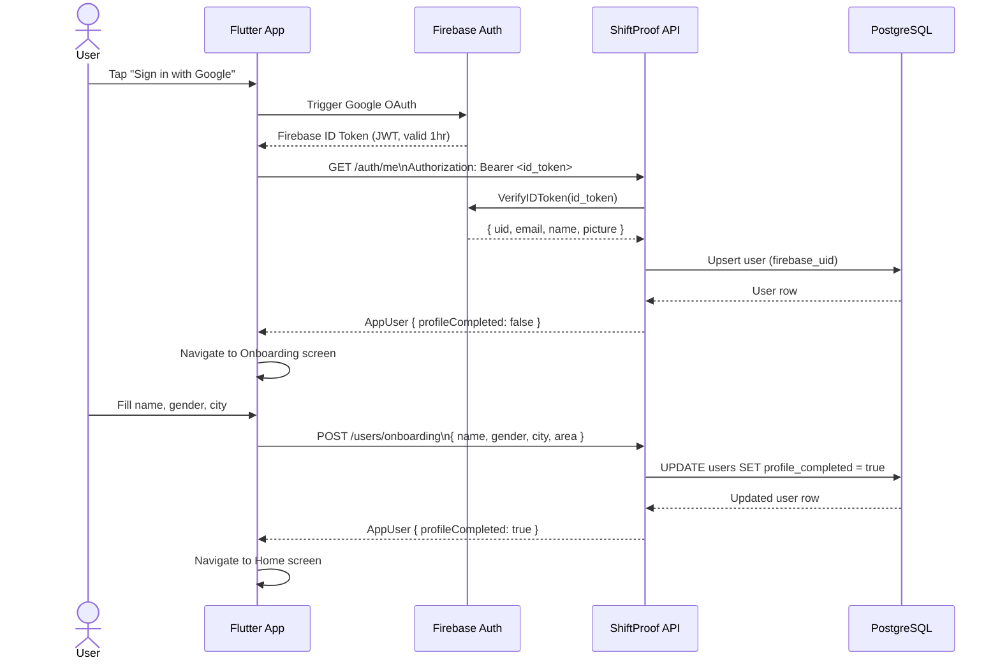

### Returning User Login

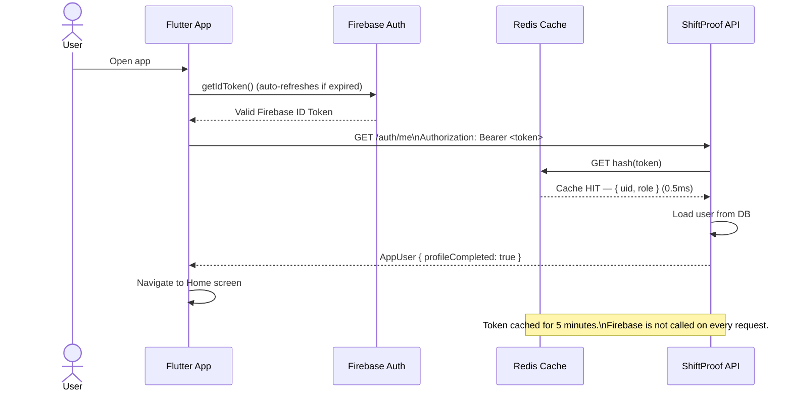

### Logout

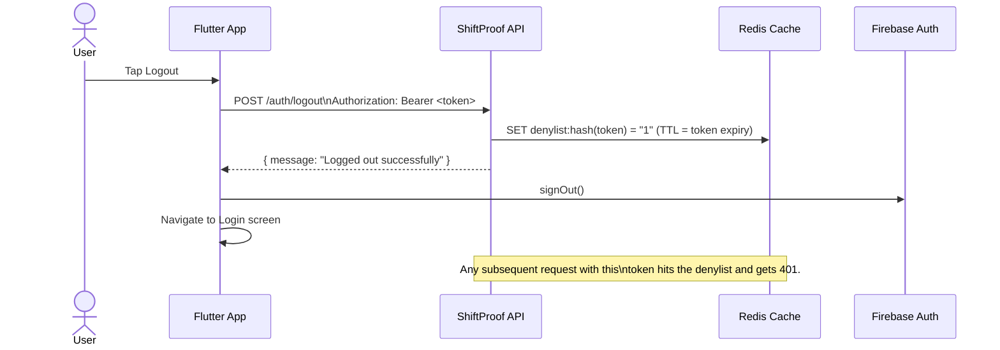

---

## 2. Owner: Add Property & Room

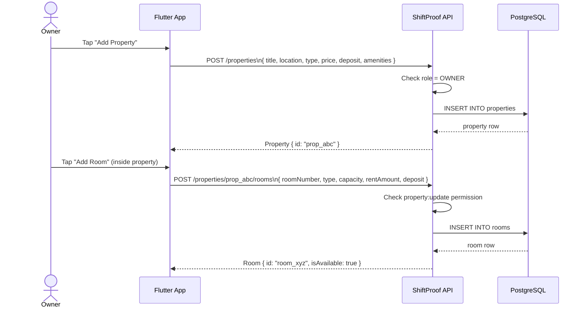

---

## 3. Tenant Invite & Join Flow

This is the most important onboarding flow in the product.

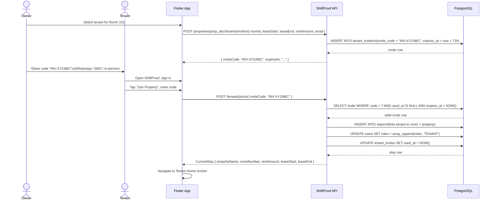

---

## 4. Payment Flows

### 4a. Manual Collection (Cash / UPI / Bank Transfer)

Owner creates payment, tenant pays outside the app, owner confirms receipt.

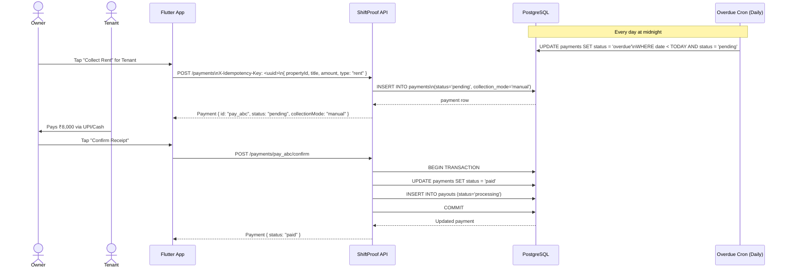

---

### 4b. Online Payment via Razorpay

Tenant pays directly in-app. Webhook is the authoritative source of truth — never show success until webhook confirms.

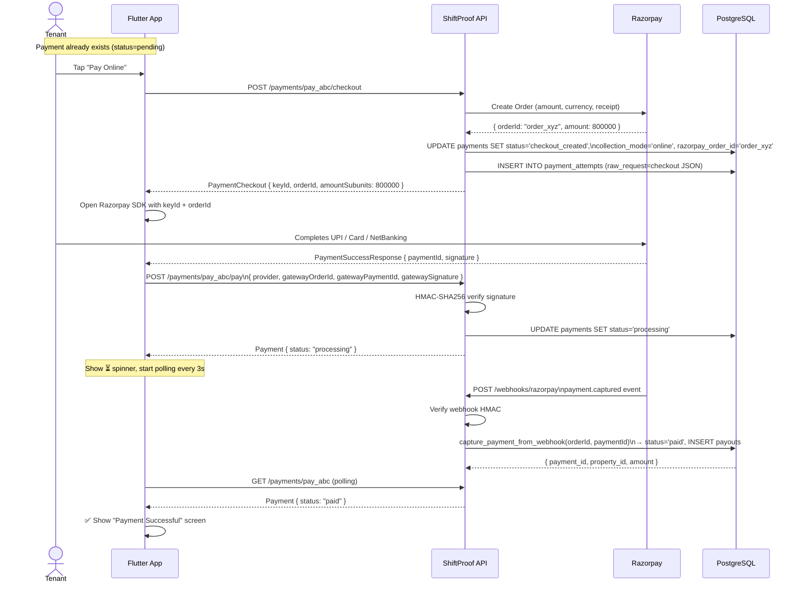

---

## 5. Subscription Flow

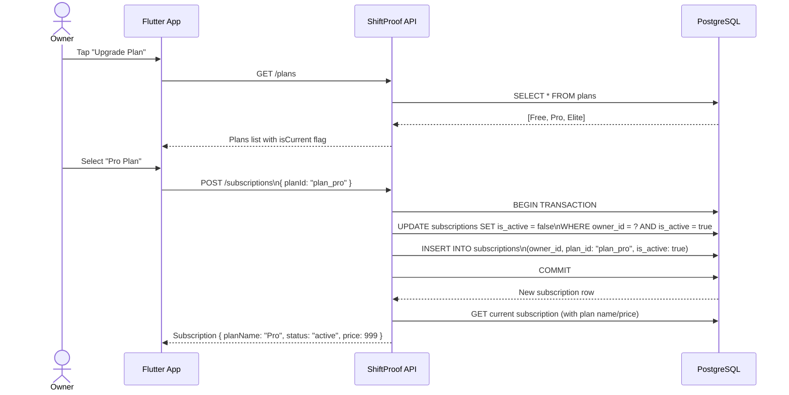

---

## 6. Notification Flow

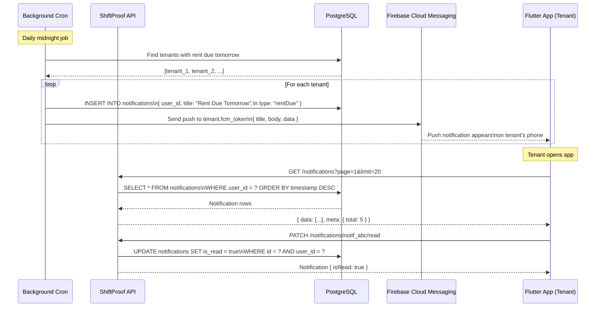

---

## 7. Monthly Report Flow

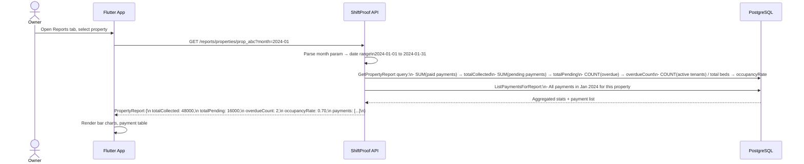

---

## 8. Policy Engine Flow

How property-level and global-role permissions are enforced on every protected request.

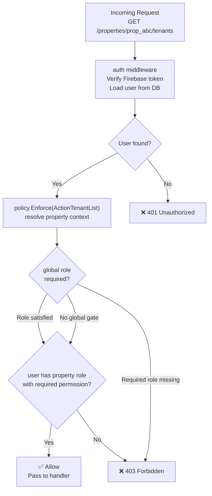

---

## 9. Avatar Upload Flow

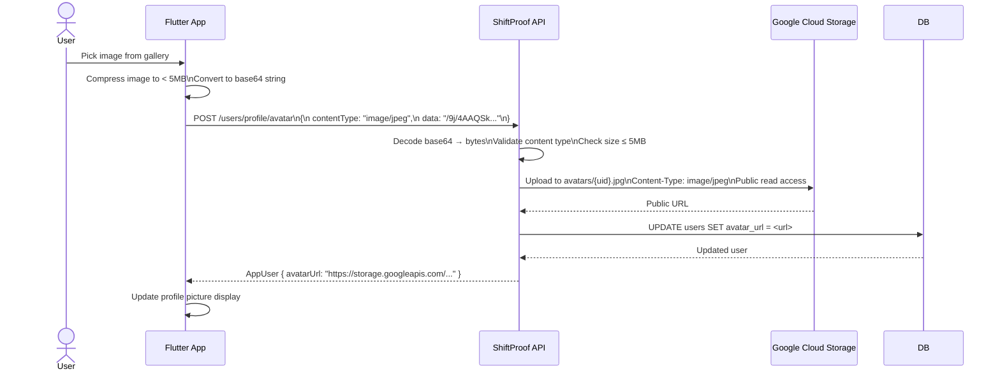
